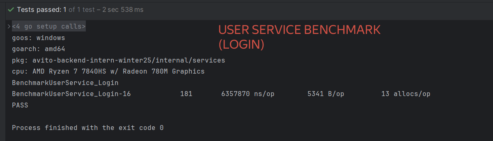
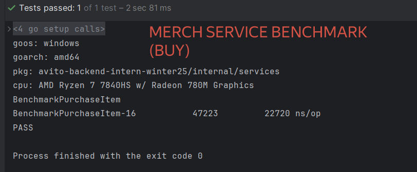
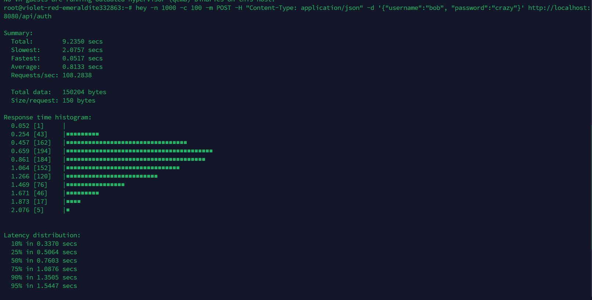
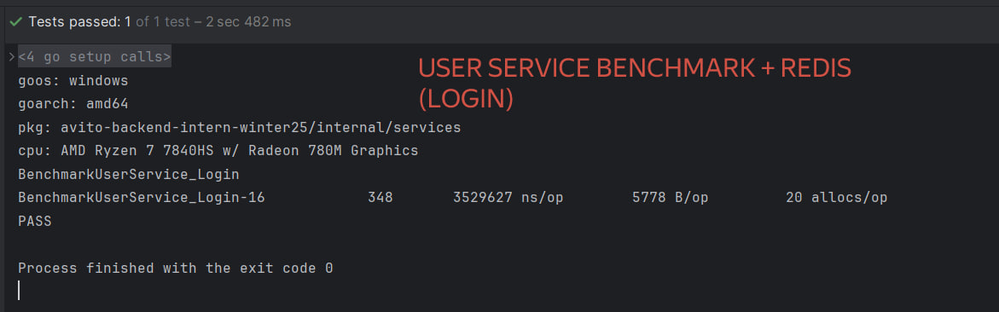
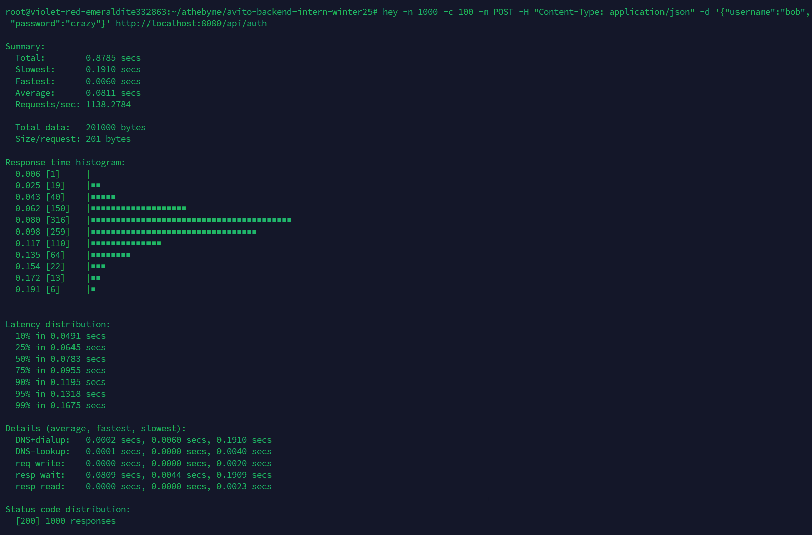
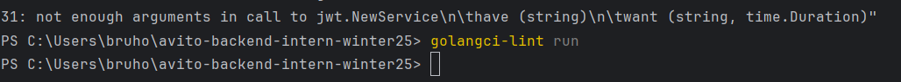

# avito-backend-intern-winter25

### Тестовое задание на позицию Backend (Go) разработчика 

## Запуск

```bash
docker-compose up --build
```

#### [!] Информация об эндпоинтах их описаниях будет ниже.
А сейчас пару слов о процессе разработки и принятых решениях: 

Я выбрал язык Go, потому как последнее время стал чаще писать именно на Go. 
Мне он полюбился сразу. До этого я писал преимущественно на Java. 

В процессе разработки было сделано несколько рефакторингов кода. Наверное, самый
главный из них - это когда мне пришлось добавлять больше интерфейсных абстракций
для того, чтобы можно было мокнуть сервисы и в последствии затестить их.

### К слову о тестах: 
- Покрытие тестами сервисов на данный момент - 91.8% (требуется >= 40%)
- Бенчмарки производительности на синтетических сервисах показывали хороший результат: 

После того как сервисы были написаны, а тесты покрыты на 90+ %, мне стало 
интересно проверить мой сервис на "боевой" нагрузке.
Тогда я задеплоил сервис на своем сервере, который использую для личного pet проекта.

С помощью команды: 
```bash
hey -n 1000 -c 100 -m POST -H "Content-Type: application/json" -d '{"username":"bob", "password":"crazy"}' http://localhost:8080/api/auth
```
Я попробовал отправить 100 одновременных запросов (х10) = 1к запросов, чтобы узнать,
действительно ли выполняется

И получил совсем не те результаты, что нужны:

**Помимо того, что среднее время было >100мс (что вдвое больше требуемого), так еще и не все запросы были 200**

**Тогда я понял, что нужно будет основательно поменять логику логина**

После изучения способов улучшения производительности - я решил остановиться на Redis + оптимизации SQL запросов к базе (индексы + транзакции ограничить только в критических зонах)

И после того, как Redis клиент был интегрирован в проект, а именно в `UserService` получились следующие результаты:


Даже в синтетическом тесте производительность улучшилась вдвое



Также стоит упомянуть, что после деплоя, возникла идея добавить сервис метрик приложения. 

Выбор остановился на метриках Prometheus, поскольку я уже реализовывал сбор метрик через него в своих проектах.

В конфигурации контейнера настроил сбор метрик каждую минуту.

**Метрики доступны по пути:**

`http://localhost:9090/metrics`


## После улучшений
- SLI (code 200) - **`100%`**
- Среднее время ответа - `35 мс` (для 50 одновременных запросов) / `61 мс` (для 100 одновременных)
- RPS (расчетный командой hey) - `1138 rps` 

После изменений в работе сервисов результаты стали полностью соответствовать условиям задания.

Также сервис доступен по прямой ссылке:

`http://199.83.103.242:8080/<endpoint>`

Или через доменное имя:

`http://avito.athebyme-market.ru:8080/<endpoint>`

# API Avito Shop

## Базовая информация
- **Версия**: 0.0.1
- **Базовый URL**: `http://localhost:8080`

## Аутентификация
Для доступа к защищённым эндпоинтам требуется **JWT-токен**.  
Используйте заголовок `Authorization: Bearer <token>`.

## Эндпоинты

### 1. Авторизация
**POST**  `/api/auth`
_Получить JWT-токен для доступа к API._

**Тело запроса (JSON):**

```json
{
"username": "user",
"password": "password"
}
```
**Ответы:**

- `200 OK` — успешная аутентификация, возвращает JWT-токен
- `400 Bad Request` / `401 Unauthorized` — ошибка входа

## Эндпоинты с JWT авторизацией

### 1. Получение информации о пользователе
**GET** `/api/info`  
_Получить информацию о монетах, инвентаре и истории транзакций._

**Ответы:**
- `200 OK` — успешный ответ
- `401 Unauthorized` — требуется аутентификация
- `400 Bad Request` / `500 Internal Server Error` — ошибка

---

### 2. Отправка монет пользователю
**POST** `/api/sendCoin`  
_Отправить монеты другому пользователю._

**Тело запроса (JSON):**
```json
{
  "toUser": "username",
  "amount": 100
}
```

---

### 3. Покупка предмета
**GET** `/api/buy/{item}`
_Купить предмет за монеты._

Параметры:

- `item` _(string, path)_ — название предмета

Ответы:

- `200 OK` — покупка успешна
- `400 Bad Request` / `401 Unauthorized` / `500 Internal Server Error`

---

### 4. Проверка баланса (доп.)

**GET** `/api/balance`  
_Получить информацию о балансе._

**Ответы:**
- `200 OK` — успешный ответ
- `401 Unauthorized` — требуется аутентификация
- `400 Bad Request` / `500 Internal Server Error` — ошибка

---

### 5. Список доступного мерча (доп.)

**GET** `/api/merch/list`  
_Получить список мерча из магазина._

**Ответы:**
- `200 OK` — успешный ответ
- `401 Unauthorized` — требуется аутентификация
- `400 Bad Request` / `500 Internal Server Error` — ошибка


## Описание линтера

```yaml
linters:
  enable:
    - errcheck
    - govet
    - staticcheck
    - revive
run:
  timeout: 2m
issues:
  max-same-issues: 10
```

- проверка на корректность обработок ошибок - `errcheck`
- проверка проблемных мест в коде (+ плохой код) - `govet`
- более глубокая проверка кода - `staticcheck`
- линтер на проверку кодстайла - `revive`

+ таймаут проверки на 2 минуты
+ максимальное кол-во ошибок одного типа - 10



/ OK